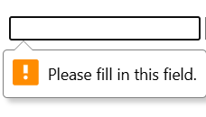
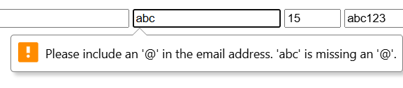
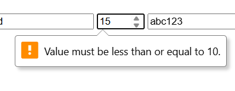
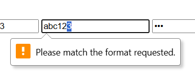
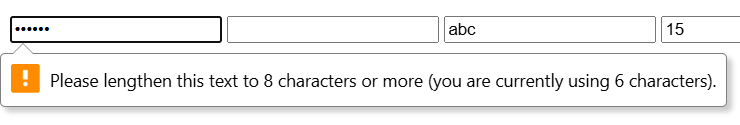

# Phần A
## Câu A1

1. type="email" -> Ô nhập text, tự kiểm tra có @ -> dùng cho form đăng ký
2. type="text" -> Ô nhập thông thường -> dùng cho form nhập thông thường (tên khách, địa chỉ..)
3. type="password" -> Ô nhập mật khẩu, ẩn kí tự -> dùng cho form nhập mật khẩu
4. type="number" -> Ô nhập số, có nút tăng giảm và không thể nhập chữ vào -> dùng cho form nhập số lượng
5. type ="date" -> Ô chọn ngày/tháng/năm, kiểm tra định dạng ngày tháng năm -> dùng để chọn ngày/tháng/năm (nhập ngày sinh)
6. type="time" -> Ô chọn thời gian (giờ, phút), kiểm tra định dạng thời gian -> dùng để chọn thời gian (đặt lịch)
7. type="color" -> Ô chọn màu, chỉ có thể chọn màu và dùng hệ RGB, SHL, HEX -> dùng để chọn màu
8. type="checkbox" -> Ô chọn có hoặc không, required -> dùng để chọn có hoặc không (chọn các thể loại để tìm sách thích hợp)
9. type="radio" -> Ô chọn 1 trong nhiều (cùng name), required -> dùng cho những lựa chọn chỉ chọn 1 (giới tính)
10. type="url" -> Ô nhập link url, kiểm tra định dạng url (http://, https://, ...) -> dùng để nhập đường dẫn

**Nguồn:** 07_forms_interactive.md: 3. ⚙️ Core Technical Truth.

---

## Câu A2

1. Trường hợp 1: không submit được tại để trống khi có required <br>

2. Trường hợp 2: không submit được tại không có @ khi type là email <br>

3. Trường hợp 3: không submit được vì 15 quá giá trị max là 10 <br>

4. Trường hợp 4: không submit được vì pattern chỉ cho nhập số <br>

5. Trường hợp 5: không submit được vì 123 chỉ có độ dài là 3 ít hơn độ dài min là 8 <br>


---

## Câu A3
1. `<label for="email">` quan trọng cho screen reader vì screen reader dựa vào label để đọc tên của input từ đó biết input này phục vụ mục đích gì
2. `<fieldset>` + `<legend>` dùng khi có 1 nhóm input phục vụ mục đích giống nhau, ví dụ:
```html
<fieldset>
  <legend>Phương thức thanh toán</legend>

  <label>
    <input type="radio" name="payment"> COD
  </label>

  <label>
    <input type="radio" name="payment"> Visa
  </label>
</fieldset>
```
3. aria-label dùng để thay thế label (đặt tên cho những phần tử nhưng không hiển thị như label, vd: button). Không nên dùng aria-label khi đã có label có thể dẫn đến screen reader đọc sai.

**Nguồn:** 07_forms_interactive.md: Accessibility — Form cho mọi người.

---

## Câu A4
1. loading="lazy" trong thẻ `` để trì hoãn load ảnh khi người dùng chưa scroll đến gần ảnh, giúp giảm băng thông, trang load nhanh hơn. Không lazy load ảnh "above the fold" (ảnh hero, logo, ảnh đầu tiên user thấy), chỉ lazy load ảnh bên dưới. 

2. Cung cấp nhiều `<source>`trong thẻ `<video>` để video có thể tương thích với nhiều trình duyệt (vì không phải trình duyệt nào cũng hỗ trợ 1 định dạng video nhất định). 3 format video web phổ biến: .mp4, .webm, .ogv

3. Thuộc tính alt trên `` dùng để mô tả ảnh cho screen reader và khi ảnh bị lỗi. alt cho các trường hợp:

    Ảnh sản phẩm iPhone 16: alt="iPhone 16"

    Ảnh trang trí (decorative): bỏ trống

    Ảnh biểu đồ doanh thu Q1/2026:  alt="Biểu đồ doanh thu quý 1 năm 2026" 

**Nguồn:** 06_graphics_multimedia.md: `` — Best Practices.

---

## Câu A5

1. Dùng cách 1 khi chỉ có ảnh đơn giản, đứng độc lập; dùng cách 2 khi ảnh kèm với chú thích

2. Ví dụ cho cách 1: icon, ảnh trang trí,..; ví dụ cho cách 2: ảnh sản phẩm, ảnh biểu đồ,..

# Phần B

# Phần C

## Câu C1

1. Lỗi 1: Dòng 1, `<form>` thiếu method và action, vi phạm best practices 
-> sửa thành `<form action="" method="post">

2. Lỗi 2: Dòng 2, input tên thiếu label, vi phạm accessibility
-> thêm `<label for="name"> Tên: <\label>` 

3. Lỗi 3: Dòng 4, input email thiếu label, không có id, name và required , vi phạm vi phạm validation, accessibility và best practices
-> sửa thành ` <input type="email" placeholder="Email của bạn" id="email" name="email" required>` và thêm `<label for="email">`

4. Lỗi 4: Dòng 6, input password thiếu label, không có id, name và required, vi phạm vi phạm validation, accessibility và best practices
-> sửa thành ` <input type="email" placeholder="Email của bạn" id="email" name="email" required>` và thêm `<label for="email">`
-> sửa thành `<input type="password" placeholder="Mật khẩu" id="password" name="password >` và thêm `<label for="password">`

5. Lỗi 5: Dòng 7, input password (nhập lại mật khẩu) thiếu label, không có id, name và required, vi phạm vi phạm validation, accessibility và best practices
-> sửa thành `<input type="password" placeholder="Mật khẩu" id="confirm-password" name="confirm_password" required>` và thêm `<label for="confirm-password">`

6. Lỗi 6: Dòng 9, số điện thoại dùng text thay vì tel và để sẵn value, thiếu label và không có id, name, required, vi phạm validation, accessibility và best practices
-> sửa thành `<input type="tel" id="phone_number" name="phone_number" required>` và thêm `<label for="phone_number">`

7. Lỗi 7: Dòng 11, select thiếu label, không có name, id và required, vi phạm validation, accessibility và best practices
-> sửa thành ```html 
              <select id="city" name="city" required>
                <option>Hà Nội</option>
                <option>TP.HCM</option>
              </select> 
              ```
  và thêm `<label for="city">Thành phố:</label>`

8. Lỗi 8: Dòng 15, thiếu checkbox cho label "Tôi đồng ý điều khoản", vi phạm validation, accessibility và best practices
-> thêm `<input type="checkbox" id="agree" name="agree" required>`

--- 

## Câu C2

1. pattern regex cho CMND/CCCD và Số tài khoản:
  `<input type="text" required id="CCCD" name="CCCD" pattern="[0-9]{12}">`
  `<input type="text" required id="account_number" name="account_number" pattern="[0-9]{10,15}">`

2. Không đủ an toàn vì: người dùng có thể chỉnh html ngay trên DevTools

3. Html không thể: so sánh giá trị (mật khẩu và xác nhận mật khẩu), truy vấn csdl, kiểm tra có điều kiện (mỗi quốc gia có một format số điện thoại khác nhau)


