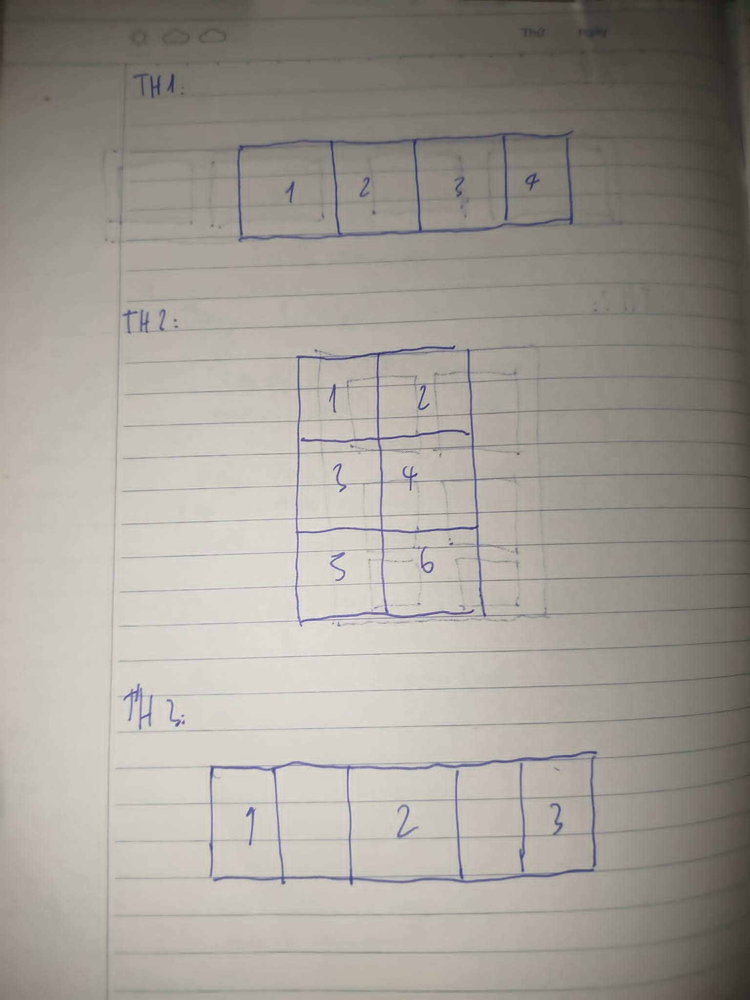
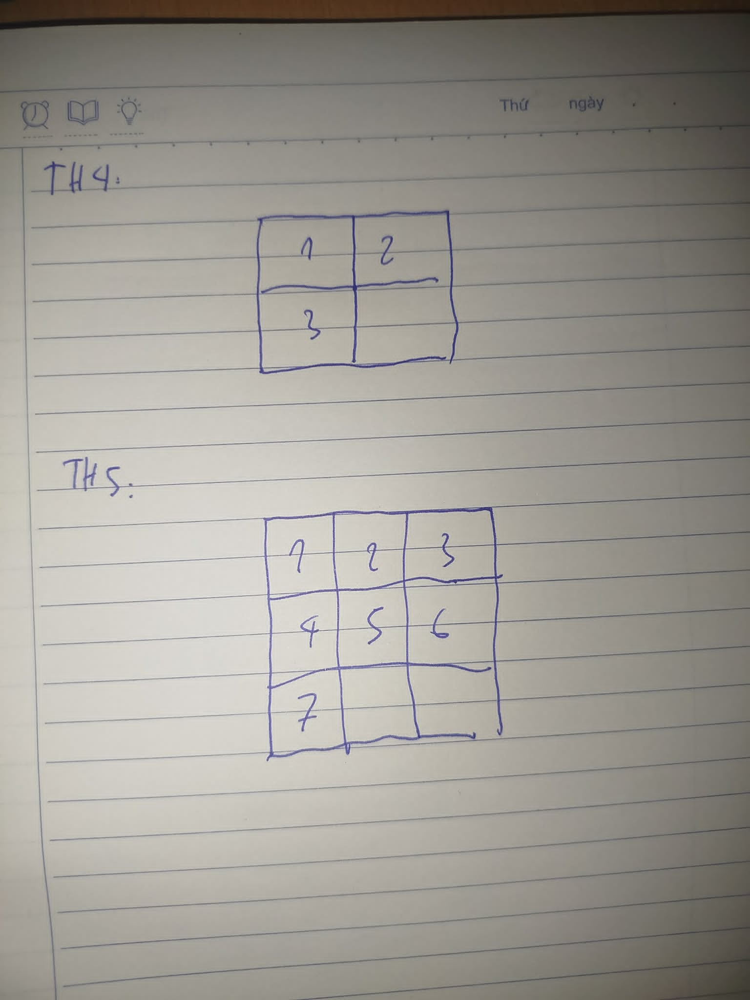

# Phần A

## Câu A1

| Position  | Vẫn chiếm chỗ trong flow? | Tham chiếu vị trí | Cuộn theo trang?  |    Use case   |
|:---------:| :------------------------:|:-----------------:|:-----------------:|:-------------:|
| static    | Có                        | Mặc định          | Có                | Mặc định      |
| relative  | Có                        | Vị trí gốc        | Có                | Làm anchor cho absolute con, dịch nhẹ |
| absolute  | Không                     | Cha gần nhất      | Không             | Badge, dropdown, tooltip, overlay|
| fixed     | Không                     | Viewport          | Không             | Chat button, cookie banner, header cố định |
| sticky    | có                        | Viewport (khi dính) | Không           | Sticky header, sticky table header, sidebar |

**Nguồn:** 12_css_positioning.md: 3. ⚙️ Core Technical Truth

---

## Câu A2

1. Trường hợp 1: 4 items sẽ có bố cục nằm ngang trên 1 hàng và đều nhau

2. Trường hợp 2: 6 items sẽ có bố cục 2 cột 3 hàng

3. Trường hợp 3: 3 items sẽ có bố cục nằm ngang trên 1 hàng (1 ở sát trái, 1 ở giữa và 1 ở bên phải)

4. Trường hợp 4: 3 items sẽ có bố cục nằm ngang trên 1 hàng với độ rộng của item 1 và 2 là 200px và của item 2 là phần còn lại

5. Trường hợp 5: 3 cột, 3 hàng 6 items đầu sẽ fill 2 hàng đầu và item thứ 7 sẽ ở ô cột 1 hàng 3

 

---